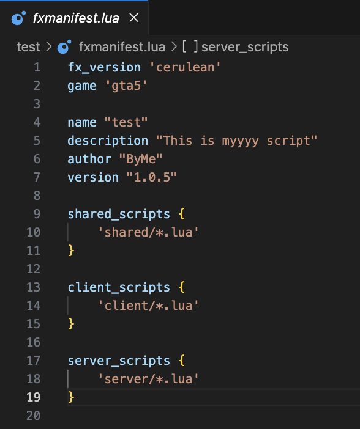

# Usage


Note that these are not all the features that my extension package has added! These are just a few tips to help you get started.


💭 How to use the FiveM Natives Intellisense (Autocompletion)?

1. Press STRG + SPACE or start typing to open the autocompletion
2. Search for any native\
   
3. 🎉 You can now use the FiveM Natives faster!\

💭 How to use the ESX Intellisense (Autocompletion)?

1. Press STRG + SPACE or start typing to open the autocompletion
2. Search for xPlayer or ESX\
   
3. 🎉 You can now use the ESX methods faster!

💭 How to use the QBCore Intellisense (Autocompletion)?

1. Press STRG + SPACE or start typing to open the autocompletion
2. Search for Player or QBCore\
   
3. 🎉 You can now use the QBCore methods faster!\
   \

💭 How to auto-restart a resource when saving?

1. Start your complete script folder in vscode (workspace)
2. Click on the `Connect` button in the bottom left bar\
   .png>)
3. After that, an input window will open. Enter the RCON password that you have defined in your CFG there\
   
4. 🎉 Now an RCON request is sent for each save and the resource (name of the workspace) is restarted as long as the password is correct.

💭 How to create a new resource?

1. Right-click in the file bar
2. Select `Generate FiveM resource`\
   
3. Follow the setup\
   
4. 🎉 You have created a new script!\
   \
   

💭 How to use the auto-formatting for LUA, JS, HTML, and CSS?

1. Create a `.vscode` folder in your workspace
2. Create the `settings.json`, use the current [settings template](https://github.com/Tuncion/vscode-fivem-development-kit/blob/main/examples/settings.json) on GitHub
3. Adjust the settings
4. 🎉 If you save a file now, the code is formatted automatically

